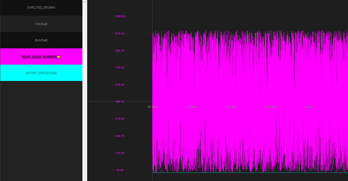

# 2022-23 Interview Design Challenge

On the Autonomous Intelligent Vehicle team at Martinrea Alfield, we try to maximize our development efficiency by providing developers with useful debugging tools. One of these tools is a live graph screen, where then developer can view live graphs of various statistics over a certain time interval. These statistics are sent to a web interface from the AIVs as a dense set of data points. These statstics include battery voltage, distance travelled, robot heading/angle, etc. Here is a screenshot of the old design (keep in mind this design was missing some features that we mention in this challenge):

 

  

Your task as the UI/UX designer is to revamp this tool by coming up with a new design that meets all of your stakeholders' requirements. Here are the requirements the development team has provided to you:

1. The interface must list all available graphable statistics
2. The user must be able to select which statstics they would like to graph from the list mentioned in requirement 1
3. The live graph must display datapoints for all statistics that the user has selected
4. The user must be able to control how long in the past they are viewing datapoints for (eg. 10s would should the last 10 seconds of datapoints, 30s would show 30 seconds, etc.)

Walk us through what steps you would take to solve this challenge. Feel free to ask any us any questions that clarify the requirements for you or that give you more context about the situation as a whole! 

By the end of your walkthrough, make sure you have completed the following:

- List stakeholders and justify why each stakeholder is in your list
- Loosely describe who the users of this interface are and what you know about them
- 