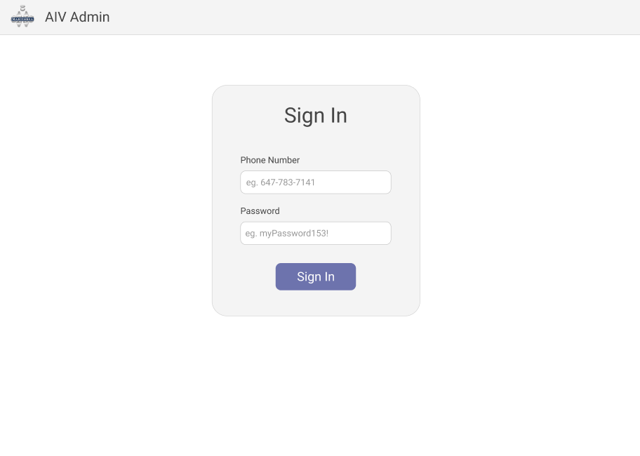
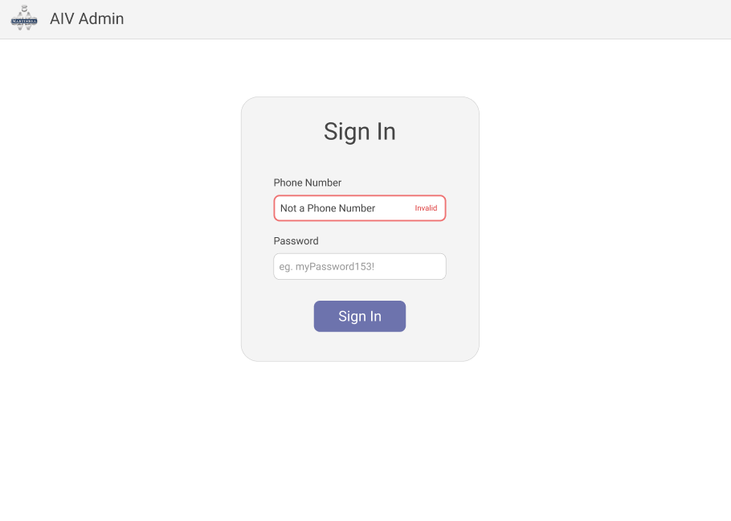
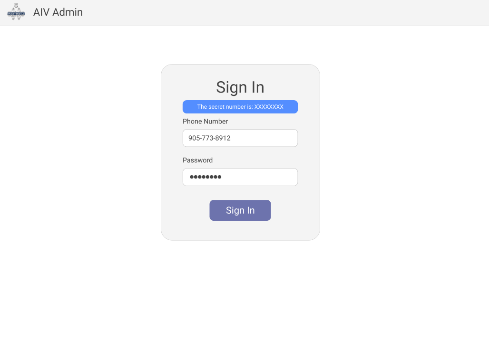

# 2022-23 Interview Front-End Challenge

On the Autonomous Intelligent Vehicle team at Martinrea Alfield, you will be tasked with implementing various web interfaces that will be used by a diverse cast of stakeholders. You will work closely with a UI/UX designer to implement their designs using a front-end web framework of your choice. These designs will vary in complexity and nature.

In this fictional scenario, the UI/UX designer has created a VERY basic design for a login screen for one of our administrative applications. On this login screen, the user is prompted to enter their phone number and password. The designer has supplied you with the following instructions:

The basic design without any interactions should match this prototype screenshot:

If the phone number field is not blank, and any phone number is entered that does not match the regular expression `^(\+\d{1,2}\s)?\(?\d{3}\)?[\s.-]\d{3}[\s.-]\d{4}$`, the interface should look something like this, without the user needing to click the "Sign In" button.

If the user clicks "Sign In" and either the phone number does not match the regex above, or the password is not `bitcoinMin3r!`, the interface should look similar to this:

Conversely, if the phone number and the password are valid, you should send an HTTP `POST` request with an empty body to `https://martinreamasks.com/api/getDonatedMasks`. The resulting response will contain one key value pair. The interface should proceed to display this message, where XXXXXXXX is replaced with the value provided by the HTTP response:

In the next 30 minutes, your task as the front-end web developer is to implement this interface using a basic HTML, CSS, and JavaScript stack. You may also use any other tools, frameworks, or styling libraries you see fit, keeping in mind that the setup time for any of these tools counts towards the time constraint.

You are encouraged to ask any questions you may have that assist you in implementing the design. You can frame these questions as though we the UI/UX designers who sent you these screenshots of the prototype.

You are also strongly encouraged to make changes where you see fit that improve the overall user-experience of the interface. Please be sure to discuss your changes to us as though we were the UI/UX designers who built the prototype.
