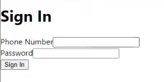

# 2022-23 Interview Front-End Challenge (Fall)

On the Frontend team at Martinrea Alfield, you will be tasked with implementing various web interfaces that will be used by a diverse cast of stakeholders. You will work closely with a UI/UX designer to implement their designs using `react`. These designs will vary in complexity and nature.

In this fictional scenario, the UI/UX designer has created a VERY basic design for a login screen for one of our administrative applications. On this login screen, the user is prompted to enter their phone number and password. The designer has supplied you with the following instructions:

The basic design without any interactions or styling should match this prototype screenshot:

Upon clicking Sign In, if the phone number is `123-456-7891` and the password is `Welcome2022@trim`, you should send an HTTP `POST` request with an empty body to `https://martinreamasks.com/api/getDonatedMasks`. The resulting response will contain one key value pair in the form `{ donatedMasks: X }`. The interface should proceed to display the message with the number of donated masks provided by the HTTP response (either on the interface or via the console log)

Your task as the front-end web developer is to implement this interface using `react` and any other libraries (tools, frameworks, styling) you see appropriate. Keep in mind that the setup time for any of these tools counts towards the time constraint.

You are encouraged to ask any questions, treat us as a UI/UX designer!

**Note: We are not too concerned about CSS. Try your best but don't spend too long on styling.**

**If you finish the implementation early you can take a look at styling your login page** [See this](Styled.md)
